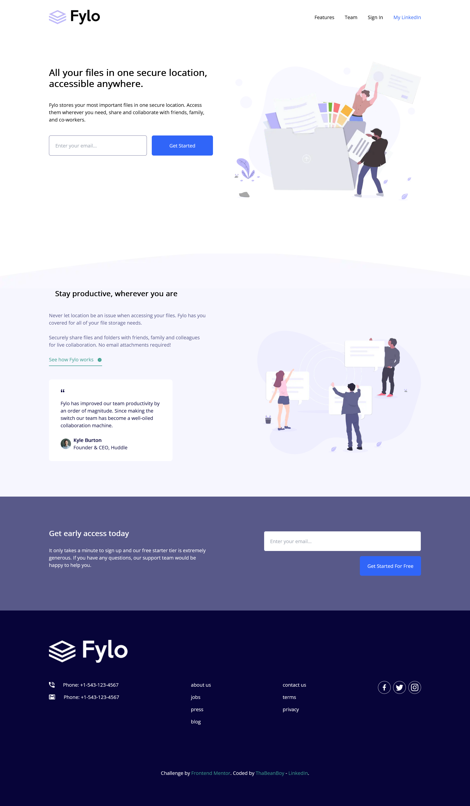

# Frontend Mentor - Fylo landing page with two column layout solution

This is a solution to the [Fylo landing page with two column layout challenge on Frontend Mentor](https://www.frontendmentor.io/challenges/fylo-landing-page-with-two-column-layout-5ca5ef041e82137ec91a50f5). Frontend Mentor challenges help you improve your coding skills by building realistic projects.

## Table of contents

- [Frontend Mentor - Fylo landing page with two column layout solution](#frontend-mentor---fylo-landing-page-with-two-column-layout-solution)
  - [Table of contents](#table-of-contents)
  - [Overview](#overview)
    - [The challenge](#the-challenge)
    - [Screenshot](#screenshot)
    - [Links](#links)
  - [My process](#my-process)
    - [Built with](#built-with)
    - [What I learned](#what-i-learned)
    - [Continued development](#continued-development)
    - [Useful resources](#useful-resources)
  - [Author](#author)

## Overview

### The challenge

Users should be able to:

- View the optimal layout for the site depending on their device's screen size
- See hover states for all interactive elements on the page

### Screenshot




### Links

- [Gatsby Js](https://your-live-site-url.com)
- [React Icons](https://react-icons.github.io/react-icons/)

## My process

### Built with

- Mobile-first workflow
- Semantic HTML5 markup
- CSS custom properties
- [Tailwind CSS](https://tailwindcss.com/) - Styling components
- Flexbox
- [React](https://reactjs.org/) - JS library
- [Gatsby Js](https://your-live-site-url.com) - React framework

### What I learned

This is the first time I ever touched Tailwind CSS. The thing I love about it is that I still had control over how I styled my components through utility. Something that I really enjoyed is that I didn't have to constantly jump between JSX & CSS files. This made it feel like I was saving a bit of time during development.

I love how you can configure Tailwind. In this project, colours & fonts were given, which were easily included in the config file. One thing I had to get used to was putting all the breakpoints in the config file.

I was worried about how everything would look if I used tailwind, but while reading through the docs [(Specifically this portion)](https://tailwindcss.com/docs/utility-first), my worries were alleviated. Something I also really loved was **Automatic class sorting with Prettier**.

The last thing I had to adjust to, was learning how to develop in a mobile-first development workflow. It didn't really take time to adjust, especially considering how you can make websites responsive using Tailwind.

```js
//Tailwind config

module.exports = {
  content: [
    "./src/pages/**/*.{js,jsx,ts,tsx}",
    "./src/components/**/*.{js,jsx,ts,tsx}",
  ],
  theme: {
    screens: {
      mobile: "375px",
      desktop: "1440px",
      // Layout breakpoint
      "min-desktop-width": "610px",

      // index breakpoints
      "landing-breakpoint": "1128px",
      "actionables-breakpoint": "536px",

      // second section breakpoints
      "second-section-breakpoint": "1180px",

      // early access breakpoint
      "early-access-breakpoint": "1012px",

      // footer breakpoint
      "footer-breakpoint": "760px",
    },

    colors: {
      // Primary
      "very-dark-blue": "hsl(243, 87%, 12%)",
      "desaturated-blue": "hsl(238, 22%, 44%)",
      // Accent
      "bright-blue": "hsl(224, 93%, 58%)",
      "moderate-cyan": "hsl(170, 45%, 43%)",
      // Neutral
      "light-grayish-blue": "hsl(240, 75%, 98%)",
      "light-gray": "hsl(0, 0%, 75%)",

      err: "hsl(339, 83%, 64%)",
      cool: "#17b019",
    },

    fontFamily: {
      "open-sans": ["Open Sans", "sans-serif"],
      raleway: ["Raleway", "sans-serif"],
    },

    extend: {},
  },
  plugins: [],
};
```

I think I need more time to read through the Tailwind docs. I was constantly using abitrary values. like below:

```jsx
<div
  id="wrapper"
  className="mx-auto flex w-[100%] max-w-[1280px] flex-col items-center px-[16px] py-[84px]
  early-access-breakpoint:flex-row early-access-breakpoint:justify-between early-access-breakpoint:px-[32px] early-access-breakpoint:py-[104px]"
>
```

### Continued development

Although the current config file has different screens, colours & font-families, what was lacking was proper spacing & font sizes. This could probably be attributed to the fact that I didn't have access to the actual design file, but rather the images of the designs alone. So I had to approximate the sizes. Using opening the design images in Figma helped when trying to determine things, but it's not always accurate.

### Useful resources

- [React Icons](https://react-icons.github.io/react-icons/) - Used to import icons in the website
- [Tailwind CSS](https://tailwindcss.com/) - Used for styling components.
- [Gatsby Js](https://your-live-site-url.com) - Used to build Static site with React

## Author

- LinkedIn - [Tiney G Chipoyera](https://www.linkedin.com/in/tineyi-g-chipoyera-0948b9193/)
- Instagram - [tiin_giib_chiip](https://www.instagram.com/tiin_giib_chiip/)
- Github - [@ThaBeanBoy](https://github.com/ThaBeanBoy)
- Frontend Mentor - [@ThaBeanBoy](https://www.frontendmentor.io/profile/ThaBeanBoy)
